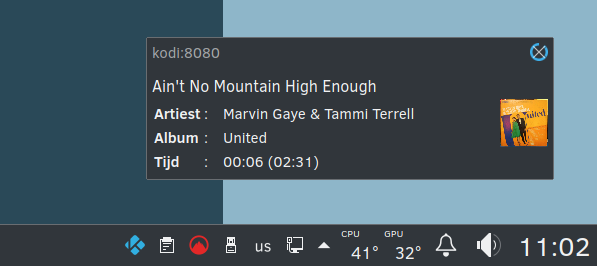

# kodi-playing
Show a notification when your Kodi server is playing a new song.

Features:

* Show currently playing song.
* Pause/play media.
* Show play list (tab delimited csv with played songs)
* Settings: kodi address, port, wait until next check, how long to show notifications, patterns to skip, autostart.
* Shutdown or reboot the system.

## Translations
You can help translating kodi-playing on [Transifex](https://www.transifex.com/abalfoort/kodi-playing)

## Screenshot

